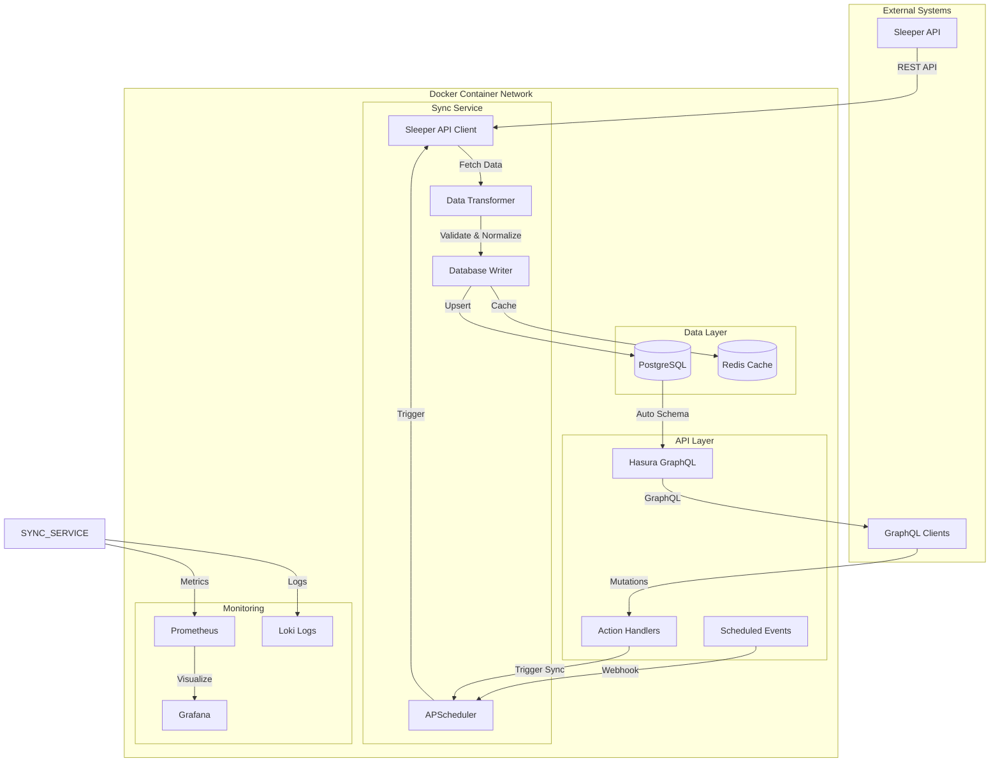
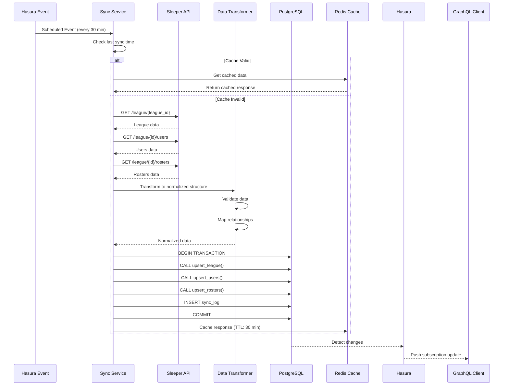
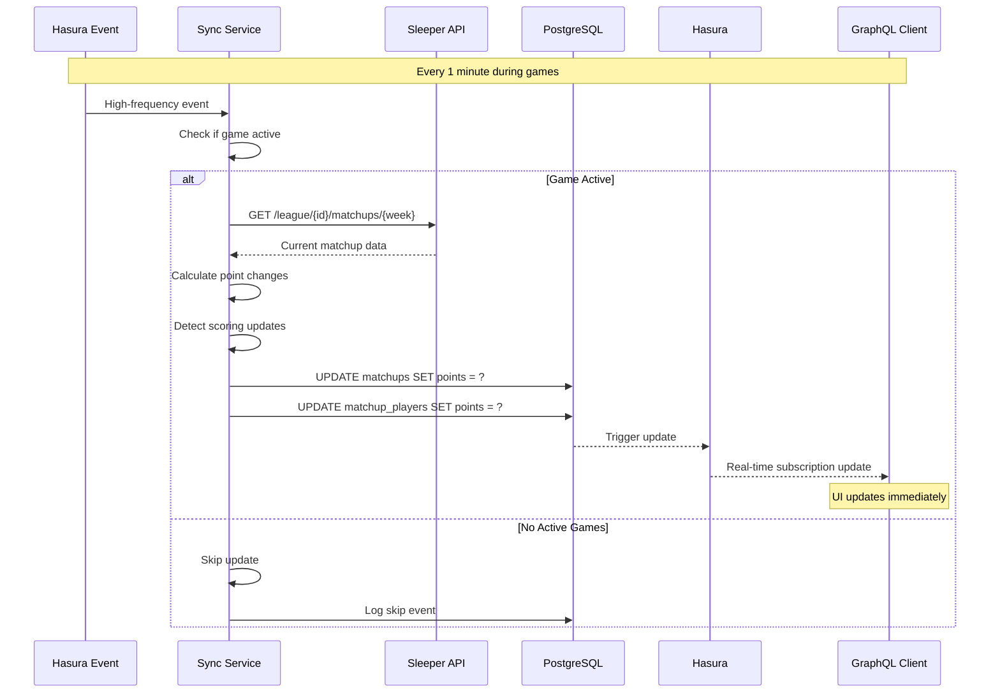
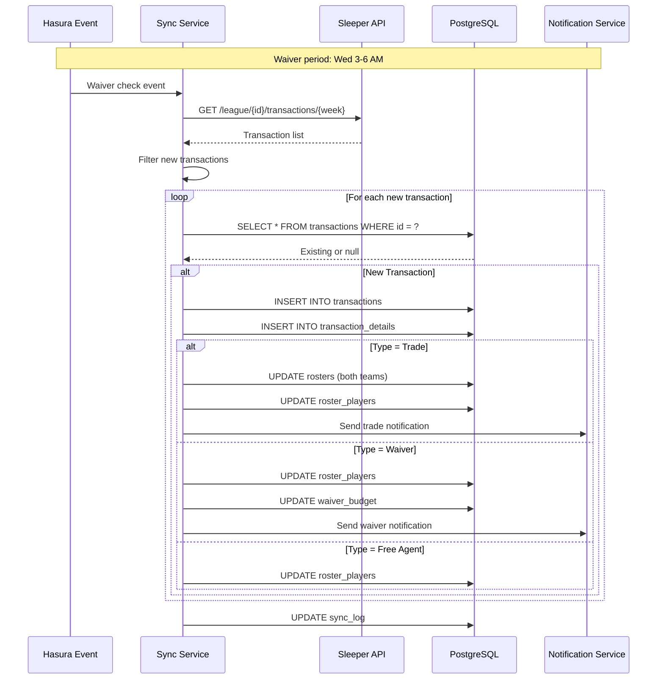
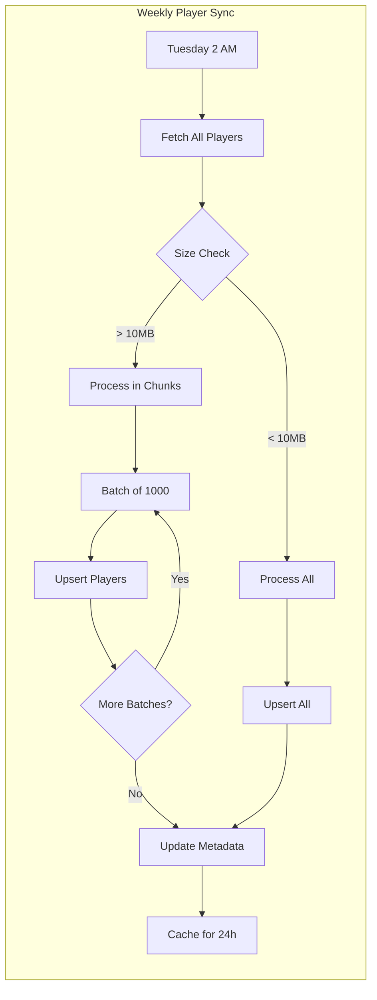
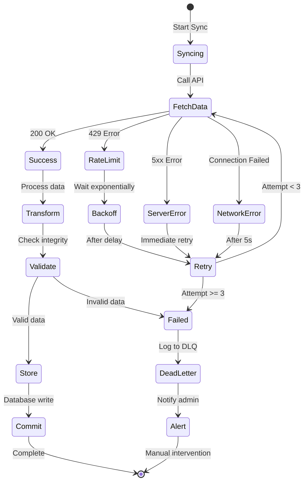
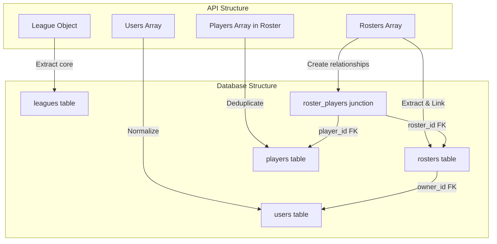
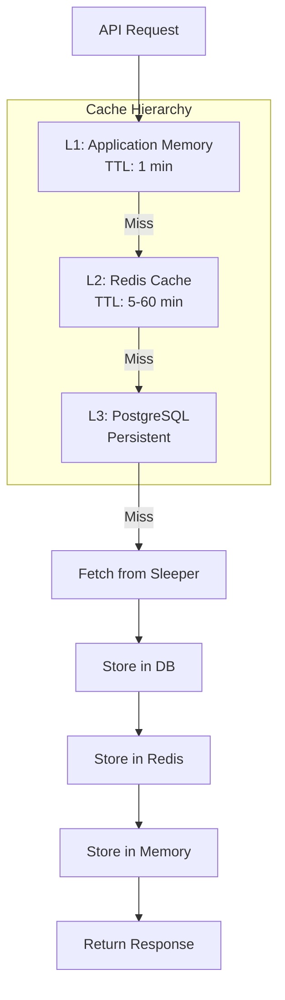
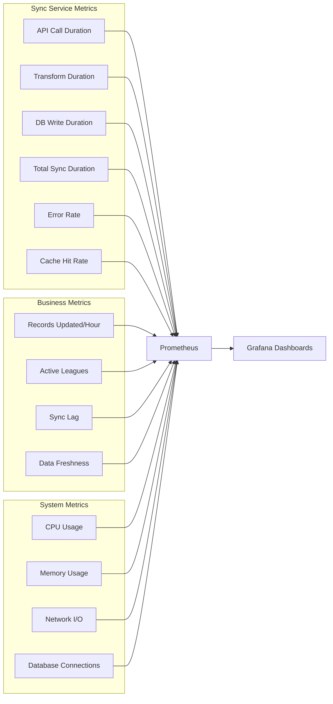
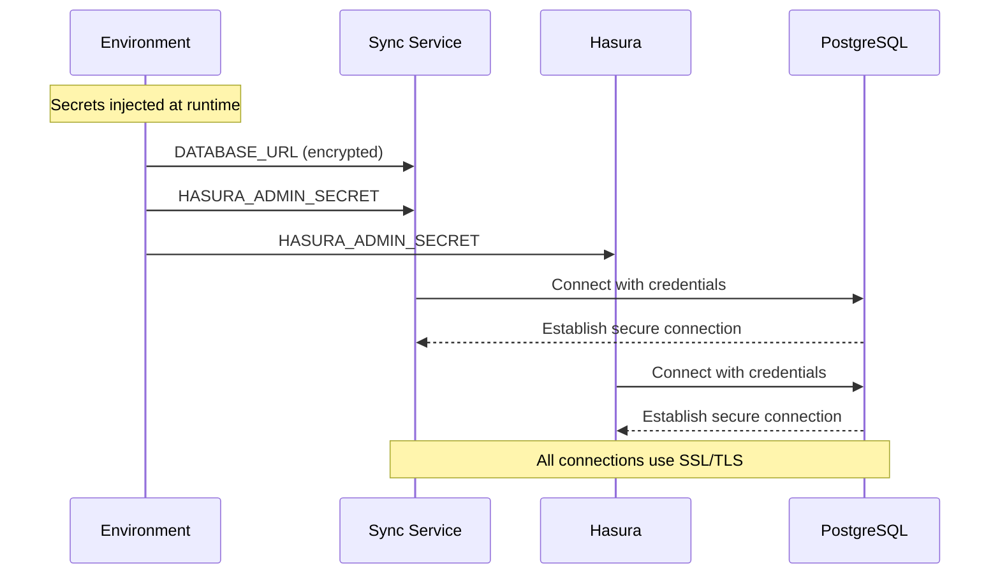

# Data Flow Diagrams & Architecture

Generated: 2025-08-24

## System Overview



## Detailed Data Flows

### 1. League Sync Flow



### 2. Live Scoring Flow (Game Time)



### 3. Transaction Processing Flow



### 4. Player Data Sync Flow



### 5. Error Handling & Recovery Flow



## Data Transformation Pipeline

### 1. API Response to Database Model

```python
# Transformation Pipeline Example
class DataTransformer:
    """Transform Sleeper API responses to database models"""
    
    def transform_league(self, api_data: dict) -> dict:
        """
        Input (API):
        {
            "league_id": "123",
            "name": "My League",
            "settings": {
                "playoff_week_start": 15,
                "waiver_type": 2,
                ...
            },
            "scoring_settings": {
                "pass_td": 4.0,
                ...
            }
        }
        
        Output (Database):
        {
            "league": {
                "league_id": "123",
                "name": "My League",
                ...
            },
            "league_settings": {
                "league_id": "123",
                "playoff_week_start": 15,
                ...
            },
            "league_scoring_settings": {
                "league_id": "123",
                "pass_td": 4.0,
                ...
            }
        }
        """
        return {
            "league": self.extract_league_core(api_data),
            "league_settings": self.extract_league_settings(api_data),
            "league_scoring_settings": self.extract_scoring_settings(api_data)
        }
```

### 2. Relationship Mapping



## Caching Strategy

### Cache Layers



### Cache Invalidation Rules

| Data Type | L1 TTL | L2 TTL | Invalidation Trigger |
|-----------|--------|--------|---------------------|
| Live Scores | 1 min | 5 min | Every update |
| Rosters | 5 min | 30 min | Transaction |
| League Settings | 30 min | 24 hours | Manual change |
| Player Metadata | 1 hour | 24 hours | Weekly sync |
| Historical Data | 24 hours | 7 days | Never |

## Concurrency & Parallelization

### Parallel Fetch Strategy

```python
async def parallel_sync_all_weeks(league_id: str):
    """Fetch all weeks in parallel for efficiency"""
    
    async with httpx.AsyncClient() as client:
        # Create tasks for all weeks
        tasks = []
        for week in range(1, 19):  # Weeks 1-18
            task = fetch_week_data(client, league_id, week)
            tasks.append(task)
        
        # Execute in parallel with concurrency limit
        semaphore = asyncio.Semaphore(5)  # Max 5 concurrent
        
        async def bounded_fetch(task):
            async with semaphore:
                return await task
        
        results = await asyncio.gather(
            *[bounded_fetch(task) for task in tasks],
            return_exceptions=True
        )
        
        # Process results
        for week, result in enumerate(results, 1):
            if isinstance(result, Exception):
                log.error(f"Week {week} failed: {result}")
            else:
                await process_week_data(week, result)
```

## Database Write Optimization

### Batch Upsert Pattern

```sql
-- Efficient batch upsert using COPY
WITH new_rosters AS (
    SELECT * FROM (VALUES
        (1, '123', 'user1', 5, 2, 0),
        (2, '123', 'user2', 4, 3, 0),
        -- ... more rows
    ) AS t(roster_id, league_id, owner_id, wins, losses, ties)
)
INSERT INTO rosters (roster_id, league_id, owner_id, wins, losses, ties)
SELECT * FROM new_rosters
ON CONFLICT (league_id, roster_id) DO UPDATE SET
    owner_id = EXCLUDED.owner_id,
    wins = EXCLUDED.wins,
    losses = EXCLUDED.losses,
    ties = EXCLUDED.ties,
    updated_at = NOW();
```

## Monitoring & Observability Points

### Key Metrics Collection Points



## Security & Data Privacy Flow

### API Key and Secret Management



## Conclusion

These data flow diagrams illustrate:

1. **Clear separation of concerns** - Each component has a specific responsibility
2. **Resilient error handling** - Multiple retry strategies and fallback mechanisms
3. **Efficient data processing** - Parallel fetching, batch writes, smart caching
4. **Real-time capabilities** - Live scoring updates pushed to clients
5. **Comprehensive monitoring** - Metrics collected at every critical point
6. **Scalable architecture** - Can handle increased load through horizontal scaling

The architecture is designed to be maintainable, observable, and performant while handling the complexities of syncing data from an external API to a normalized database structure.